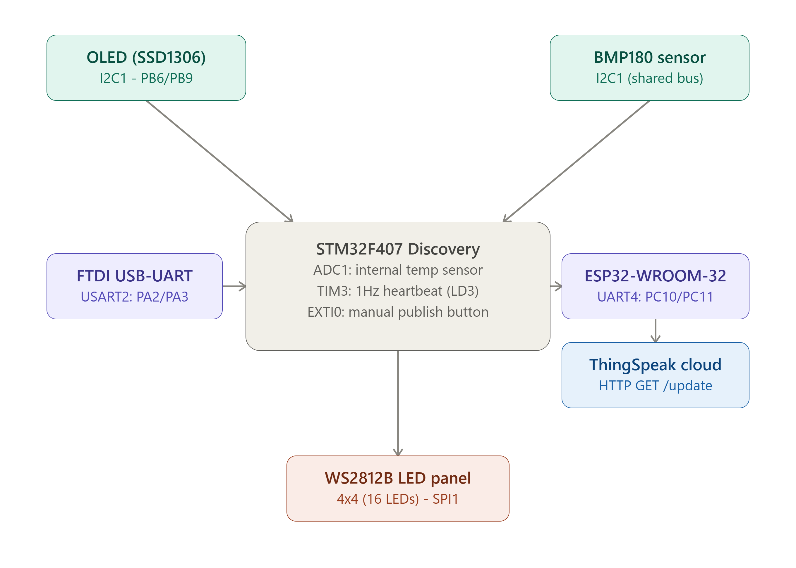
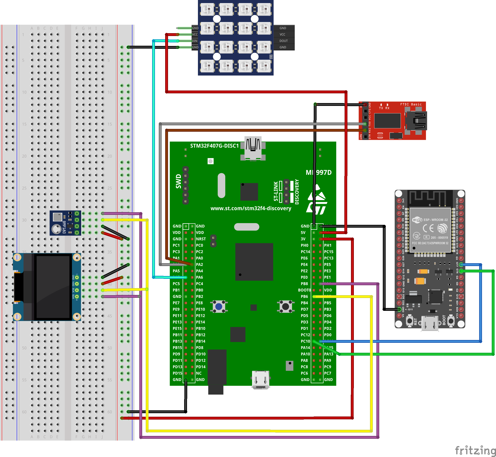
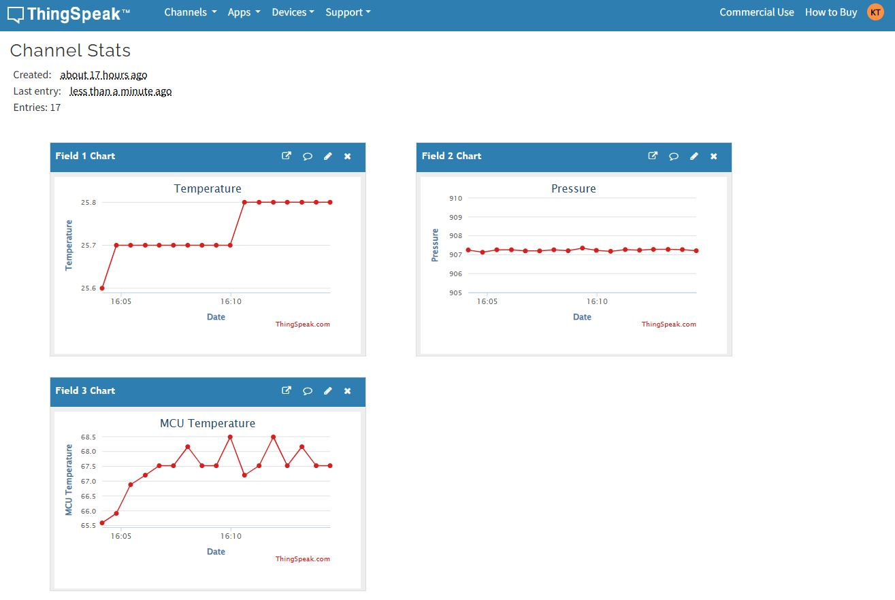
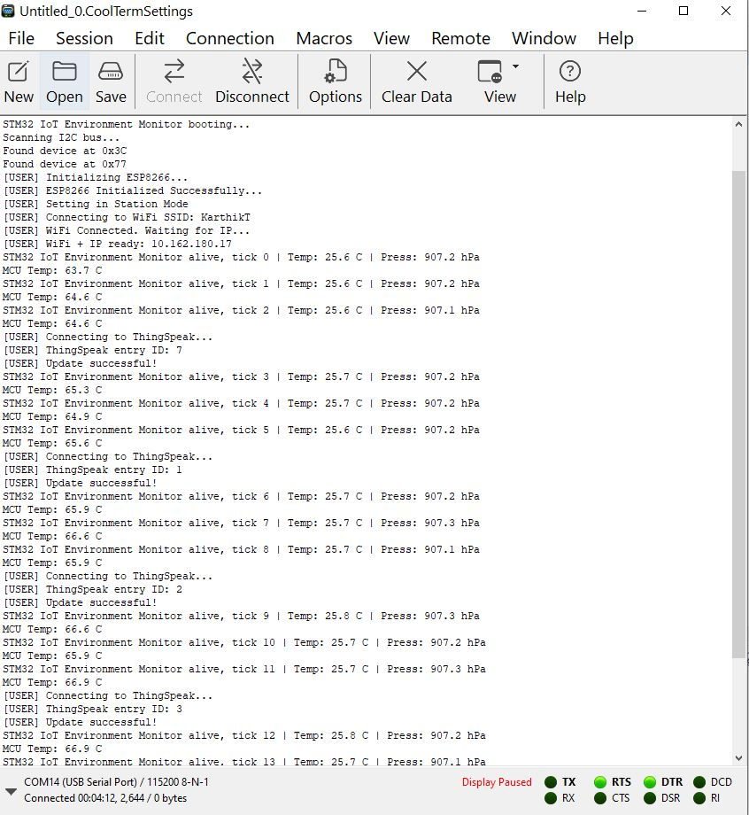
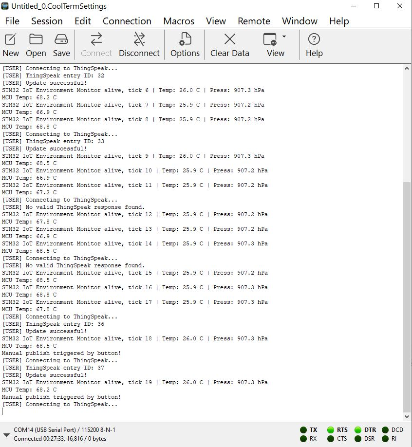
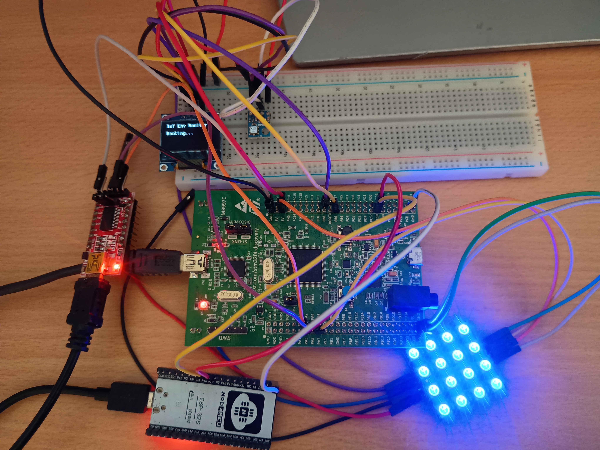
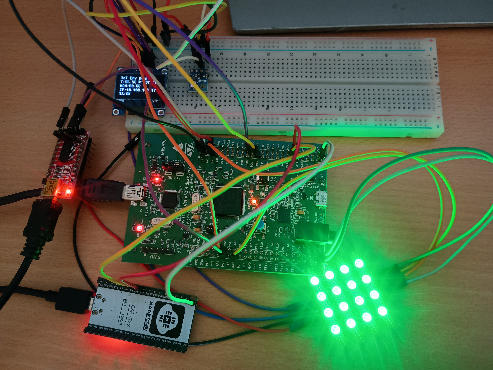
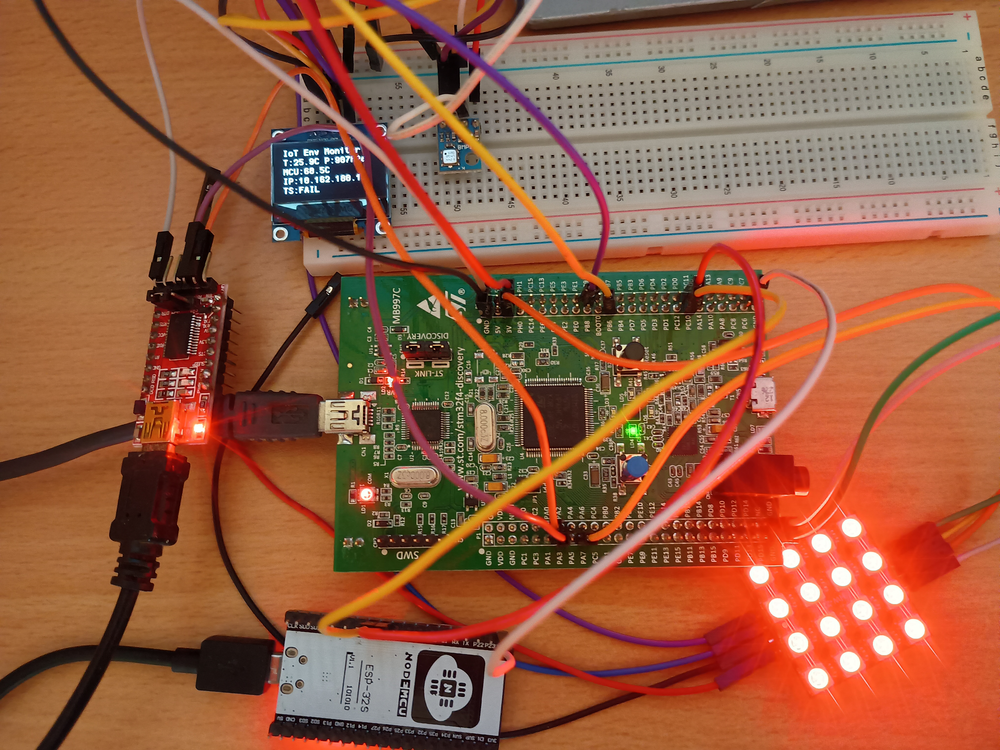
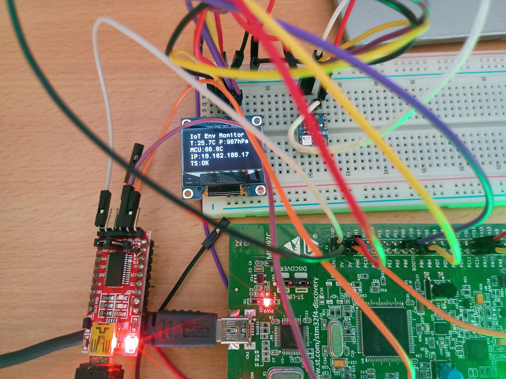

# STM32 IoT Environment Monitor

An ARM Cortex-M4 (STM32F407 Discovery) based environmental monitoring system. It reads live temperature and pressure over I2C, shows everything on a local OLED, indicates system status on an RGB LED panel, and pushes the readings to the cloud (ThingSpeak) over WiFi using an ESP32 running Espressif's AT firmware as a wireless bridge.

Built as a Situational Learning Assignment for BITS WILP ESZG514 (Embedded System Design), and doubles as a resume project since it touches basically every core STM32 peripheral: ADC, Timer interrupts, external interrupts, I2C, SPI, and UART.

# Requirements

a) STM32F407G-DISC1 (Discovery board, STM32F407VGT6, Cortex-M4)

b) BMP180 temperature & pressure sensor

c) 0.96" OLED display (SSD1306, I2C)

d) 4x4 WS2812B RGB LED panel (16 LEDs)

e) ESP32-WROOM-32, flashed with Espressif ESP-AT firmware

f) FTDI USB-UART adapter (for debug/status logging)

g) Breadboard + jumper wires

h) ThingSpeak account

# How it works

- Every 5 seconds, the STM32 reads temperature and pressure from the BMP180, reads its own internal die temperature via the ADC, and updates the OLED with all of it plus the current WiFi/IP status.
- Every 15 seconds (ThingSpeak's free-tier minimum interval), it pushes temperature, pressure, and MCU temperature to a ThingSpeak channel over WiFi via the ESP32, using plain AT commands.
- A hardware Timer interrupt (TIM3) blinks an onboard LED once a second, completely independent of the main loop, proof the interrupt is genuinely asynchronous, not just a delay in disguise.
- Pressing the onboard user button fires an EXTI interrupt that forces an immediate cloud publish, instead of waiting for the next 15-second cycle.
- The WS2812 panel reflects live system state: blue while booting, green after a successful publish, red if WiFi drops or a publish fails.

# Circuit Diagram

Connect the SCL and SDA pins of both the OLED and the BMP180 to PB6 and PB9 respectively (they share the same I2C1 bus, different addresses, no conflict). Connect the WS2812 panel's DIN to PA7 (SPI1 in half-duplex mode). Connect the ESP32's GPIO17 (TX) and GPIO16 (RX) to PC10 and PC11 (UART4). Connect the FTDI's RX and TX to PA2 and PA3 (USART2) for the debug console. Full pin table is below.

## Pin Mapping

| Signal | STM32F407 Discovery Pin |
|---|---|
| I2C1_SCL (OLED + BMP180) | PB6 |
| I2C1_SDA (OLED + BMP180) | PB9 |
| SPI1_MOSI (WS2812 DIN) | PA7 |
| UART4_TX -> ESP32 RX | PC10 |
| UART4_RX <- ESP32 TX | PC11 |
| USART2_TX -> FTDI RX | PA2 |
| USART2_RX <- FTDI TX | PA3 |
| User button (EXTI0) | PA0 |
| Heartbeat LED (LD3) | PD13 |
| Status LED (LD4) | PD12 |
| Internal temp sensor | ADC1 (internal channel, no pin) |

The STM32's own USB (ST-LINK) and the ESP32's USB are each powered independently from the PC, no shared power wiring between them.

# Setup

1. Open iot_stm32_project1.ioc in STM32CubeIDE and click Generate Code once. This pulls in the STM32 HAL/CMSIS driver library (not included in this repo, since it's vendor boilerplate) without touching any of the custom code in Core/Src, since CubeMX only regenerates the sections outside the USER CODE markers.
2. Wire everything per the pin table above.
3. Flash the ESP32 with Espressif's ESP-AT firmware (v4.1.1.0, straight from `dl.espressif.com`, via `esptool.py`).
4. In `Core/Src/app.c`, fill in your own WiFi SSID/password and your ThingSpeak Write API Key.
5. Build and flash to the board through the onboard ST-LINK.
6. Open a serial terminal (115200 baud, e.g. Tera Term or CoolTerm) on the FTDI's COM port to watch it boot and connect.

# Results

ThingSpeak channel: https://thingspeak.mathworks.com/channels/3466268

Live sensor data plotted against time on ThingSpeak ie temperature, pressure, and MCU die temperature:

Serial console on boot, I2C bus scan, WiFi connect, first few ThingSpeak publishes:

Serial console showing the manual publish button in action, notice the extra "Manual publish triggered by button!" entries outside the normal 15-second cadence:

`app.c` in STM32CubeIDE, with the ThingSpeak publish + WS2812 status logic visible:

## WS2812 status panel

The panel reflects live system state, no two of these photos are staged, they're the actual states firing during normal operation:

| Booting (blue) | Publish succeeded (green) | Publish failed / WiFi disconnected (red) |
|---|---|---|
|  |  |  |

## OLED live readout

# Known Limitations of my board

My STM32F407 discovery board's internal temperature sensor has no factory-calibrated offset (unlike some newer STM32 families), so the absolute reading can be off by tens of degrees chip-to-chip — this is a documented characteristic of the sensor confirmed on ST's own community forum, not a bug in this code. It's still fine for trend/relative monitoring, and the safe junction temperature limit (105C) is nowhere close regardless.

ThingSpeak's free tier enforces a 15-second minimum update interval, which sets the cloud publish cadence here.

# Third-Party Drivers

This project builds on a few open-source drivers rather than writing everything from scratch:

- SSD1306 OLED driver which was originally built by Tilen Majerle, ported to STM32 HAL by Alexander Lutsai (GPLv3)
- BMP180 driver, WS2812 SPI driver, and ESP8266/ESP32 AT-command UART driver referred from ControllersTech

# References

[1] SSD1306 OLED tutorial: https://controllerstech.com/oled-display-using-i2c-stm32/

[2] BMP180 interfacing: https://controllerstech.com/interface-bmp180-with-stm32/

[3] WS2812 over SPI: https://controllerstech.com/ws2812-leds-using-spi/

[4] ESP8266/ESP32 AT WiFi bring-up: https://controllerstech.com/stm32-esp8266-wifi-ip/

[5] ESP8266 + ThingSpeak publish: https://controllerstech.com/stm32-esp8266-thingspeak-bme280/

[6] Espressif ESP-AT firmware: https://docs.espressif.com/projects/esp-at/en/latest/esp32/

[7] STM32F407 internal temp sensor discussion, ST Community: https://community.st.com/stm32-mcus-products-25/stm32f407vgt-temperature-85998

[8] STM32 UART transmit/receive fundamentals (FTDI-based console): https://controllerstech.com/stm32-uart-1-configure-uart-transmit-data/
